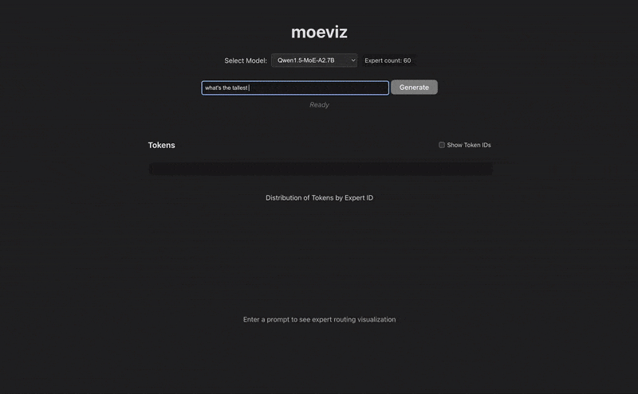

# moeviz

visualize token routing in mixture-of-experts models



## Setup

The visualization uses `vite` and `d3`, which requires `Node.js version 18+/20+`.

```bash
cd client
npm install
npm run dev
```

Use `uv` to setup and activate Python environment. Then:

```bash
# Install in editable mode
uv pip install -e .

# Start the server
python3 moeviz/server.py
```

## Configuration

`moeviz` can be configured using environment variables:

| Environment Variable | Description | Default |
|---|---|---|
| `MOEVIZ_SERVER_HOST` | Server host address | `0.0.0.0` |
| `MOEVIZ_SERVER_PORT` | Server port | `8000` |
| `MOEVIZ_BASE_URL` | Base URL for client connections | `http://{host}:{port}` |
| `MOEVIZ_ENABLE_CORS` | Enable CORS for API | `true` |
| `MOEVIZ_MAX_NEW_TOKENS` | Max tokens for generation | `128` |
| `MOEVIZ_THREAD_POOL_WORKERS` | Number of worker threads | `1` |

### Examples

```bash
# Run on port 9000
MOEVIZ_SERVER_PORT=9000 python3 moeviz/server.py

# Custom server base URL for client (e.g., when behind a proxy)
MOEVIZ_BASE_URL=https://moeviz.example.com python3 moeviz/server.py
```
